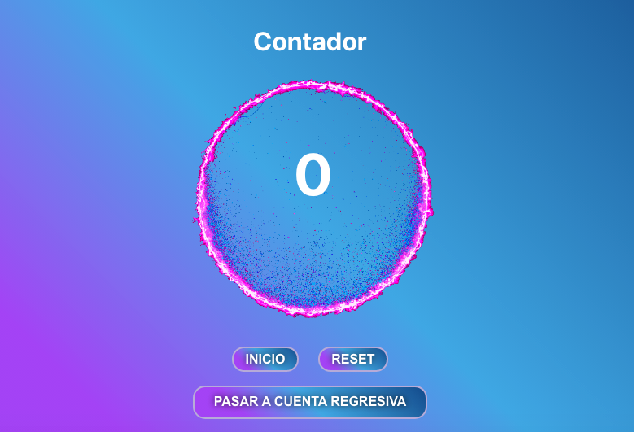
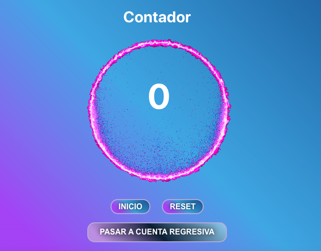

## React Hooks Timer App

Esta es una App sencilla, utilizando los features de React __Hooks__ que nos permiten el uso de manejos de estados y llevar a cabo efectos secundarios en nuestros componentes funcionales.

La App es un Contador y Cuenta Regresiva que puede cambiar entre ambos.
Lo que hace es funcionar como un contador de segundos y a la vez si se cambia de funcionalidad a Cuenta Regresiva puede restar esos segundos y además se puede escribir una cantidad de segundos para la cuenta regresiva.

* Al hacer click en el botón de `RESET` el valor de la cuenta regresiva también vuelve a cero

* Al hacer click en el botón `PASAR A CONTADOR` la app cambia de funcionalidad a ser como un cronometro de segundos.

* Al hacer click en el botón `PASAR A CUENTA REGRESIVA` la app cambia de funcionalidad a ser una Cuenta Regresiva.

### SCREENSHOOTS
  

   

   

